# Reward Shop Planner

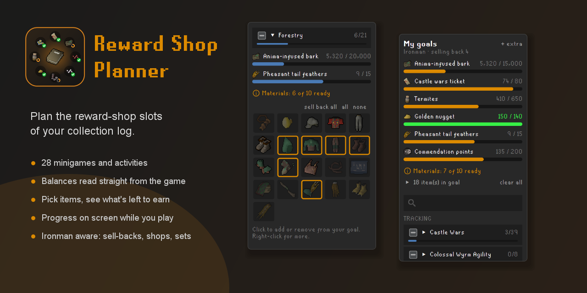

Plan the reward-shop slots of your collection log. Pick the items you want, and the planner tells
you how many points, tokens or items you still need to earn, using the balances it reads straight
from the game.

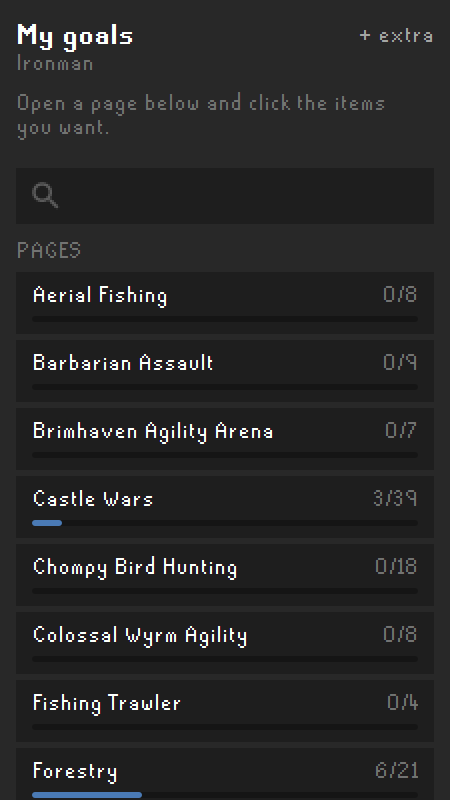

## Features

- **28 minigames and activities**: Castle Wars, Pest Control, Mage Training Arena, Barbarian Assault,
  Forestry, Mastering Mixology, Guardians of the Rift, Tithe Farm, Trouble Brewing and more.
- **Your log, synced**: open the collection log and click Search once, and the planner knows what you already have.
- **Balances read from the game**: bank and inventory items, the Forestry kit, reward shop screens and
  game messages. No typing numbers in.
- **Materials counted too**: the logs, bars and thread some rewards need show "have / need", from your
  bank, inventory (noted ones included) and log basket.
- **One goal for everything**: every item you pick adds up into one bar per currency, with extra goals
  for things outside the log (sawmill vouchers, anyone?).
- **Knows the rules**: upgrades that trade items in (Lumberjack into Forestry, Void into Elite Void),
  recoloured sets bought once, items you can sell back after logging them, and your account type.
- **You choose the shop**: items sold in two places, like the prospector kit, wait for you to pick.
- **Progress on screen**: while you play a minigame, its goal shows on the game screen, so you don't
  need to open the side panel.
- **Made for cloggers**: tick a whole page, or every page at once, instead of picking item by item.

| Your goals | Pick items like in the log | Choose where to buy |
|---|---|---|
| 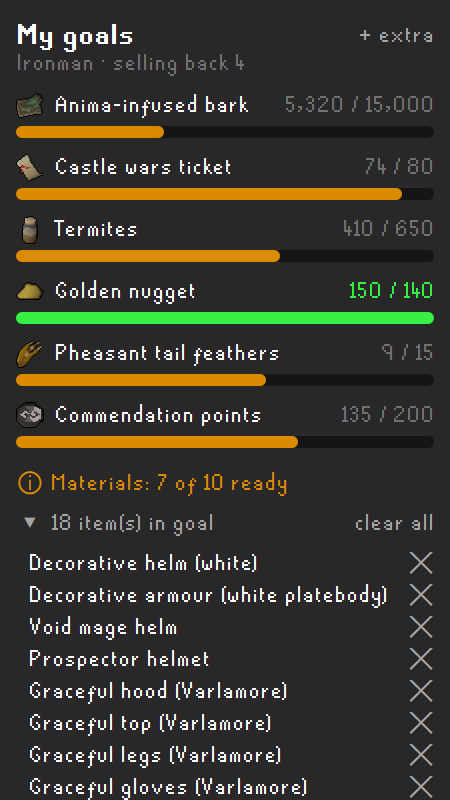 | 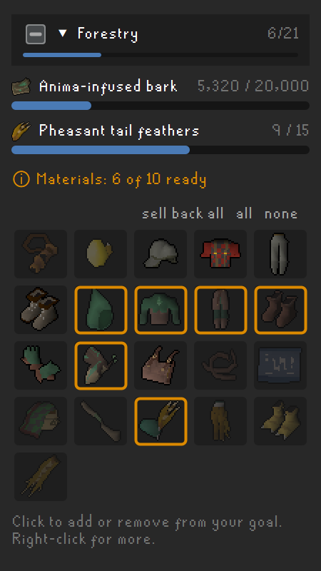 | 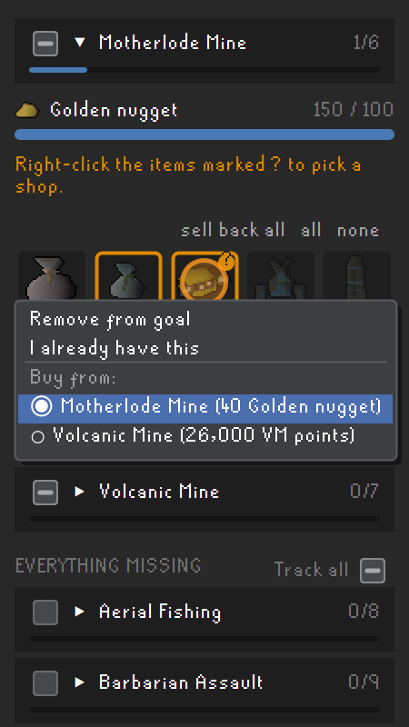 |

| Sell-backs, your choice | Sell back a whole page | Sets bought as one |
|---|---|---|
| 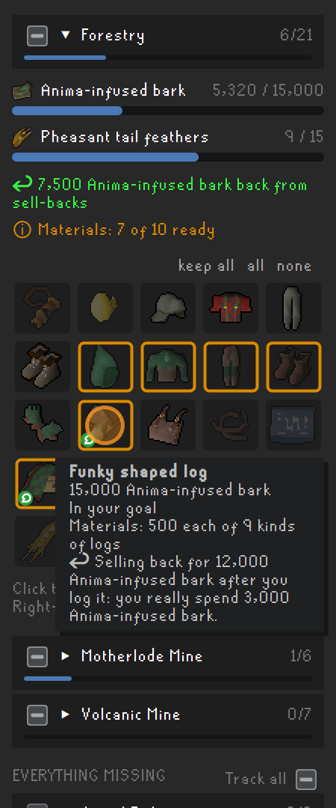 | 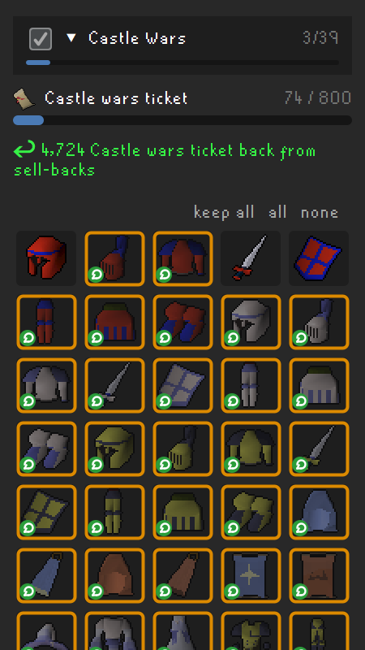 | 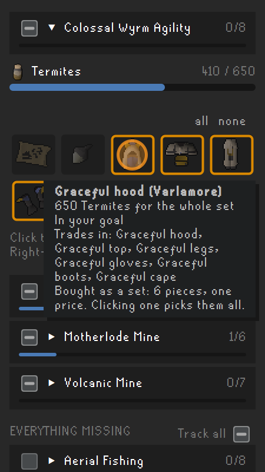 |

Nothing is sold back unless you choose it. Right-click an item and pick **Sell back after logging it**, or use
**sell back all** on a page (handy for Castle Wars). The goal then counts what you really spend, and never less
than what you must hold to buy the items one at a time. Your account type is read from the game, so
ultimate ironmen never count the Forestry sell-backs they can't make. TzHaar prices follow your Karamja gloves. Recoloured outfits
like the Varlamore graceful are one purchase for the whole set, and the planner adds the base set they trade in.

### On-screen progress

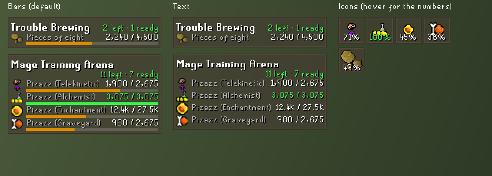

At a minigame, the page's goal shows on the game screen: how many items are left, how many you can already
buy (one after another, counting what comes back from sell-backs), and each currency with its icon.

- **Where it shows**: at the minigame itself, from the lobby and the reward shop to inside the game.
  Activities without a fixed place (Forestry, Shooting Stars, Mahogany Homes) show up when you earn their
  currency, stay while you keep earning, and hide a few minutes after you stop.
- **Only when it matters**: nothing shows for a page with nothing in your goal.
- **Your style**: bars (the default), text only, or icons like buff timers. Each activity can be turned
  off in the settings.

### For cloggers

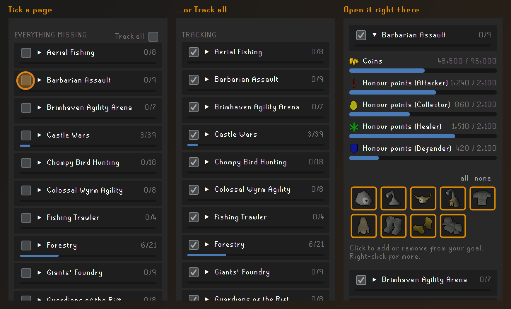

The page list is split in two: **Tracking**, the pages you're working on, and **Everything missing**. Tick
a page to put all its missing slots in your goal, or tick **Track all** for the whole log. A half-ticked box
means only some of the page is in your goal. Pages open as a dropdown right in the list, so you never lose
your place.

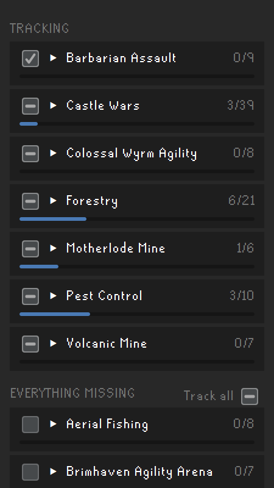

### Materials

| On each page | For your whole goal |
|---|---|
| 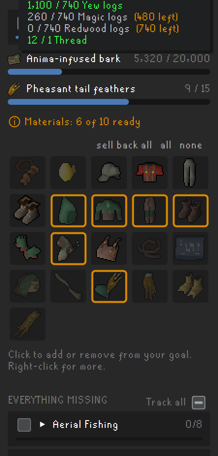 | 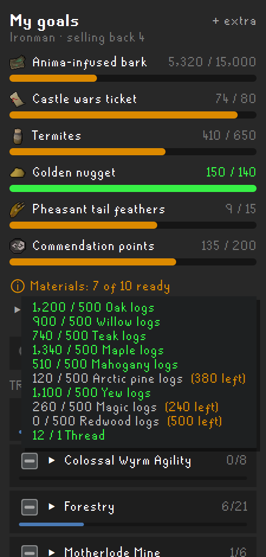 |

Some rewards also take logs, bars or thread (the Forestry outfit, the funky shaped log, the log brace...).
Hover **Materials** to see what you have against what you need. The count adds your bank (as of the last
time you opened it), your inventory and your log basket, and updates as you go.

### Tokkul and Karamja gloves

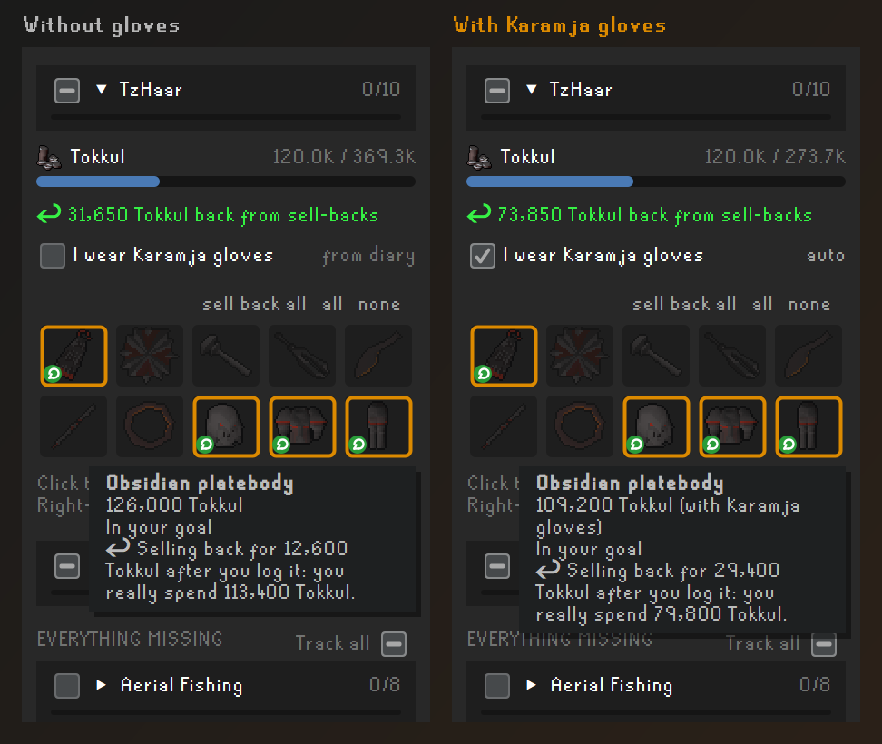

Wearing Karamja gloves makes the TzHaar shops about 13% cheaper and more than doubles what they pay back.
Tick **I wear Karamja gloves** on the TzHaar page. It starts ticked once you've claimed the gloves from the
Karamja easy diary, is saved per character, and **auto** goes back to following the diary. Buying the obsidian
armour and cape to sell them back needs about 274K tokkul instead of 369K.

## How to use

1. Open the **Reward Shop Planner** panel from the sidebar.
2. Open your collection log in game and click **Search** once: every page syncs in one go. (Opening a
   single page also syncs that page.)
3. Tick the pages you want to finish, or open one and click the items you want. A gold frame means
   "in my goal".
4. Watch **My goals** in the panel, or just play: the progress shows on screen at each minigame. Hover a
   bar for details, right-click an item for more options.

Balances update as you play: open your bank once, and visit a minigame's reward shop to refresh its points.

## Settings

| Setting | What it does |
|---|---|
| Hide completed pages | Hide pages where you own everything that can be bought. |
| Show on-screen progress | Show your goal's progress on the game screen at each activity. |
| Style | Bars (default), Text, or Icons like buff timers. |
| Hide after | For activities without a fixed place: minutes without earning before the progress hides (0 keeps it until you log out). |
| On-screen progress: activities | Turn the progress off for any activity. |

## Development

```
./gradlew test                 # unit tests
./gradlew run                  # RuneLite in developer mode with the plugin loaded
powershell -ExecutionPolicy Bypass -File scripts/generate-data.ps1   # refresh data from the OSRS Wiki
```

Requires JDK 11. Item and price data come from the [OSRS Wiki](https://oldschool.runescape.wiki) and are
bundled with the plugin; see `scripts/sources.json` for the hand-curated parts.

Screenshots in `docs/marketing` are rendered from the real panel with sample data
(`MarketingRenderer`, run with `RENDER_MARKETING=1` after `scripts/fetch-preview-icons.ps1`).

## License

BSD 2-Clause, see `LICENSE`.
